# SwiftUI API 比較カタログ — Web (SwiftWasmUI) vs iOS (SwiftUI)

**読み手と目的**: SwiftWasmUI の利用者・コントリビュータ向けに、実装済みの各 UI API が
本家 SwiftUI とどこまで同じ見た目になるかを示す。**両列とも同一の Swift コード**
(各節に掲載)を、左は SwiftWasmUI でブラウザに、右は SwiftUI で iPhone シミュレータ
(iOS 26.4)に描画したスクリーンショット。

再撮影方法は末尾の「再現手順」を参照。

| 画面 | 検証対象 API |
|---|---|
| [Text](#text) | `Text` `.font` `.foregroundColor` `.lineLimit` `.multilineTextAlignment` |
| [Button](#button) | `Button` `.disabled` |
| [Controls](#controls) | `TextField` `Toggle` `@State` / `Binding` |
| [Image](#image) | `Image(systemName:)` |
| [Stacks](#stacks) | `VStack` `HStack` `ZStack` `Spacer` |
| [List](#list) | `List` `ForEach` |
| [ScrollView](#scrollview) | `ScrollView` `Divider` |
| [Shapes](#shapes) | `Rectangle` `RoundedRectangle` `Circle` `Capsule` `.fill` `.opacity` `.shadow` `.border` |
| [Progress](#progress) | `ProgressView` |
| [Modifiers](#modifiers) | `.padding` `.background` `.cornerRadius` `.border` `.shadow` `.opacity` |
| [Glass](#glass) | `.glassEffect` |

---

## Text

```swift
VStack(alignment: .leading, spacing: 12) {
    Text("Large Title").font(.largeTitle)
    Text("Title").font(.title)
    Text("Headline").font(.headline)
    Text("Body").font(.body)
    Text("Caption").font(.caption)
    Text("Colored").foregroundColor(.red)
    Text("The quick brown fox ...").lineLimit(2)
    Text("Center aligned multiline text that wraps across lines")
        .multilineTextAlignment(.center)
        .frame(width: 220)
}
.padding()
```

| Web (SwiftWasmUI) | iOS (SwiftUI) |
|---|---|
| 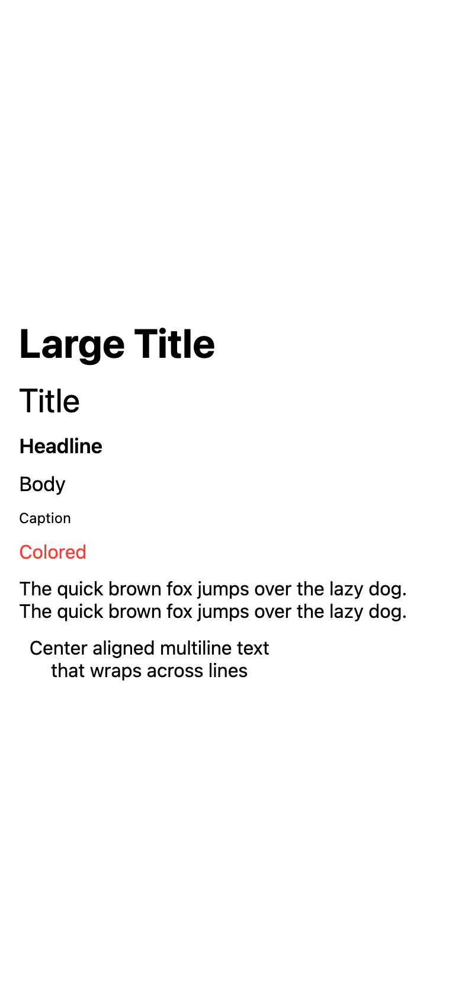 | 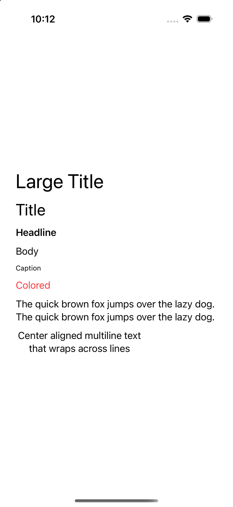 |

差異: Web の `.largeTitle` はやや太い(SwiftUI の Large Title は regular ウェイト)。
フォントは両者とも SF 系(-apple-system)。

## Button

```swift
VStack(spacing: 20) {
    Button("Default Button") {}
    Button("Destructive") {}
        .foregroundColor(.red)
    Button("Disabled") {}
        .disabled(true)
}
.padding()
```

| Web (SwiftWasmUI) | iOS (SwiftUI) |
|---|---|
| 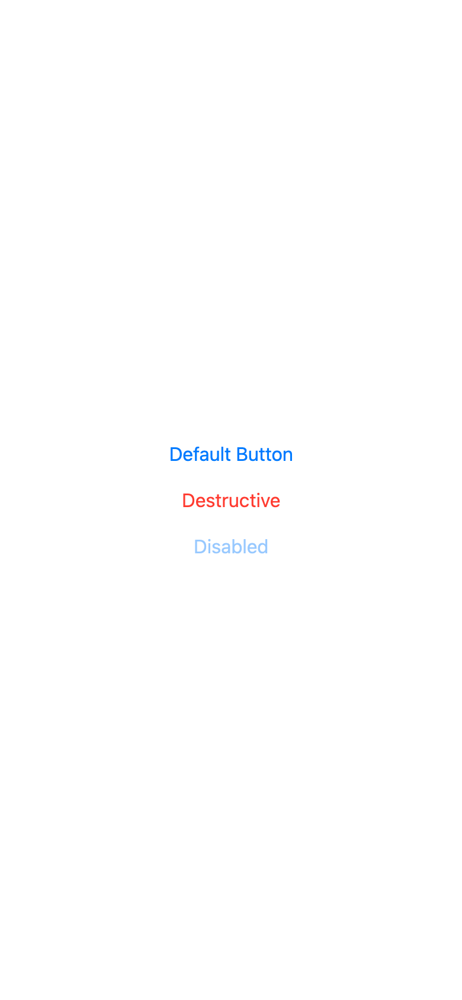 | 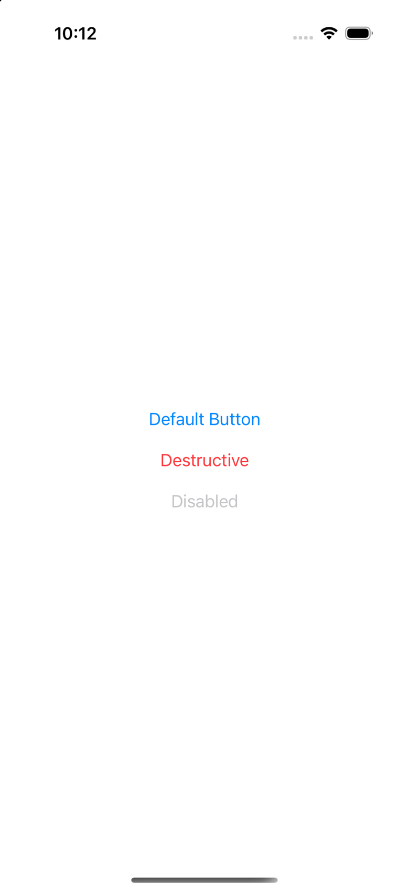 |

差異: ほぼ同一(plain スタイル)。`.buttonStyle(.bordered)` 等は未実装(ROADMAP Phase 1)。

## Controls

```swift
VStack(spacing: 20) {
    TextField("Enter text", text: $text)
    Toggle("Notifications", isOn: $on)
    Toggle("Dark Mode", isOn: $off)
}
.padding()
```

| Web (SwiftWasmUI) | iOS (SwiftUI) |
|---|---|
| 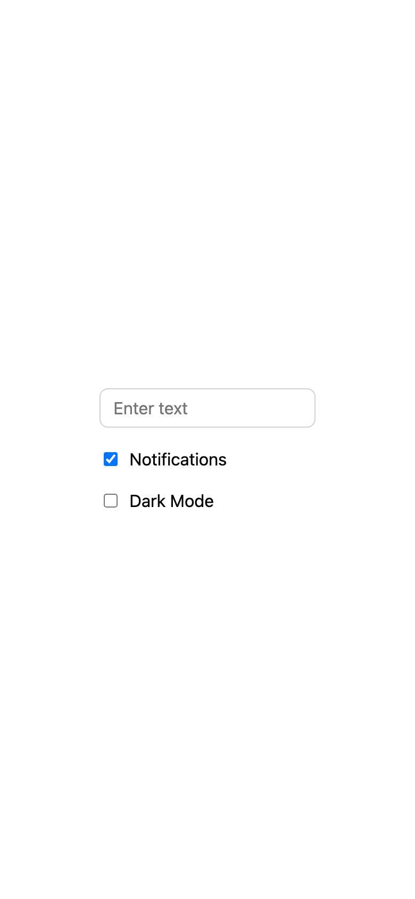 | 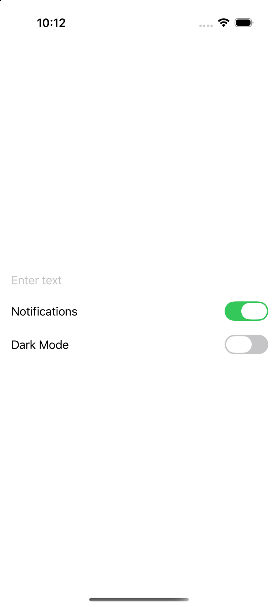 |

差異(既知のギャップ):

- `TextField`: Web は角丸ボーダーを既定にしている(iOS の既定は装飾なし)
- `Toggle`: Web はチェックボックス実装。iOS のスイッチ風スタイルへの置き換えは今後の課題
- `Toggle` のレイアウト: iOS はラベル左・スイッチ右端(スペーサー挟み)、Web はチェックボックス左

## Image

```swift
HStack(spacing: 20) {
    Image(systemName: "heart.fill").foregroundColor(.red)
    Image(systemName: "star.fill").foregroundColor(.blue)
    Image(systemName: "person.circle")
    Image(systemName: "trash")
}
.font(.title)
```

| Web (SwiftWasmUI) | iOS (SwiftUI) |
|---|---|
| 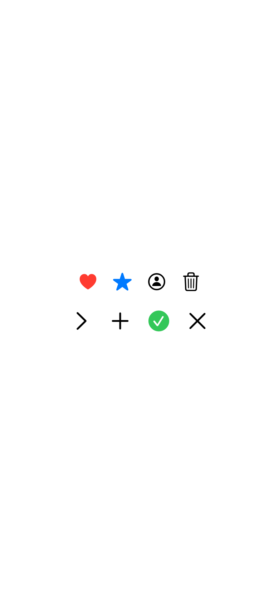 | 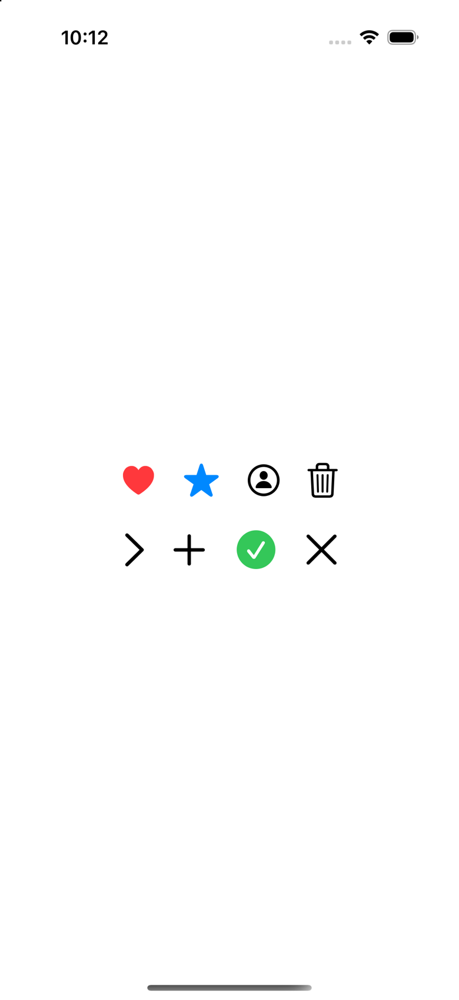 |

差異: Web のグリフは [Framework7 Icons](https://framework7.io/icons/)(MIT)。
SF Symbols は Apple プラットフォーム外で使用できないため、SF Symbols 名(ドット記法)を
アンダースコア記法へ変換して対応グリフを表示する。細部の形は異なるが意味は一致する。

## Stacks

```swift
VStack(spacing: 20) {
    HStack(spacing: 8) { /* 角丸矩形 x3 */ }
    HStack {
        Text("Leading")
        Spacer()
        Text("Trailing")
    }
    .frame(width: 260)
    ZStack {
        RoundedRectangle(cornerRadius: 16).fill(.blue)
            .frame(width: 160, height: 90)
        Text("ZStack").foregroundColor(.white).font(.headline)
    }
    .frame(height: 90)
}
```

| Web (SwiftWasmUI) | iOS (SwiftUI) |
|---|---|
| 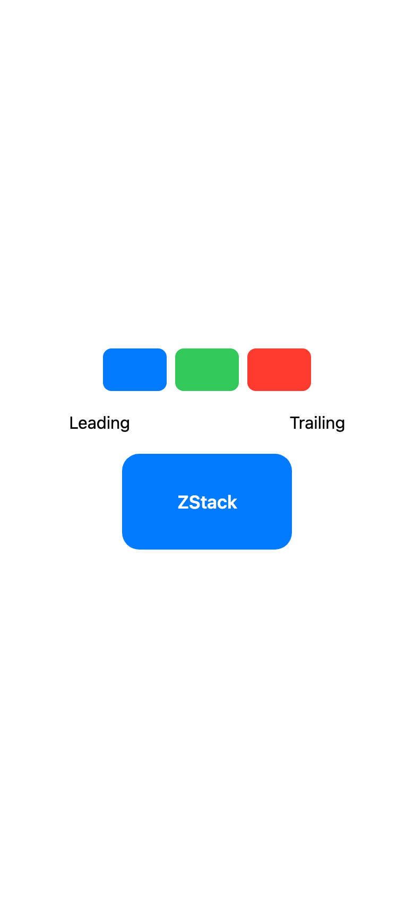 | 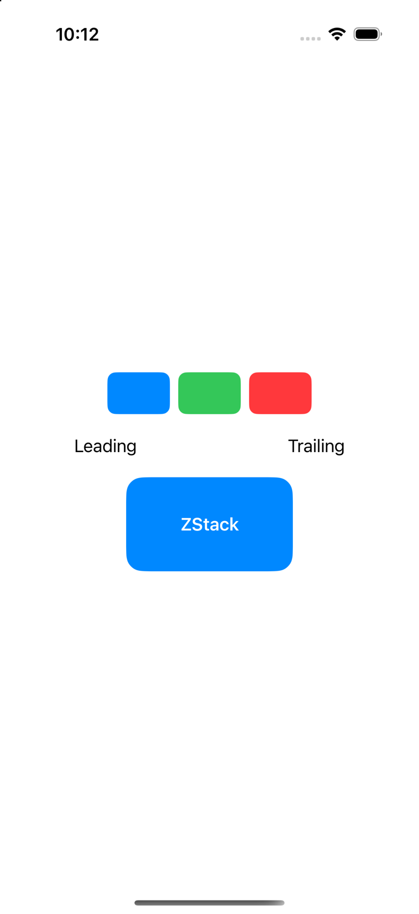 |

差異: なし(flexbox 実装で `Spacer` も同じ挙動)。

## List

```swift
List {
    ForEach(["Apple", "Banana", "Cherry", "Durian", "Elderberry"], id: \.self) { fruit in
        Text(fruit)
    }
}
```

| Web (SwiftWasmUI) | iOS (SwiftUI) |
|---|---|
| 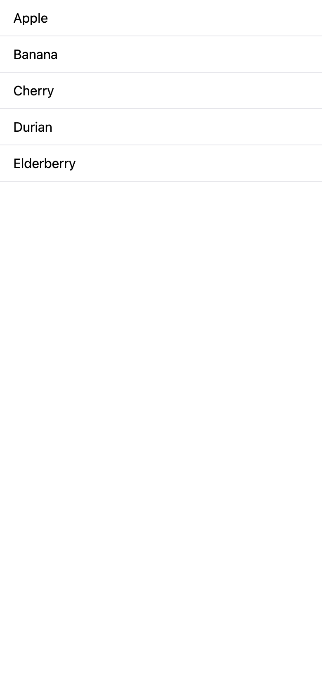 | 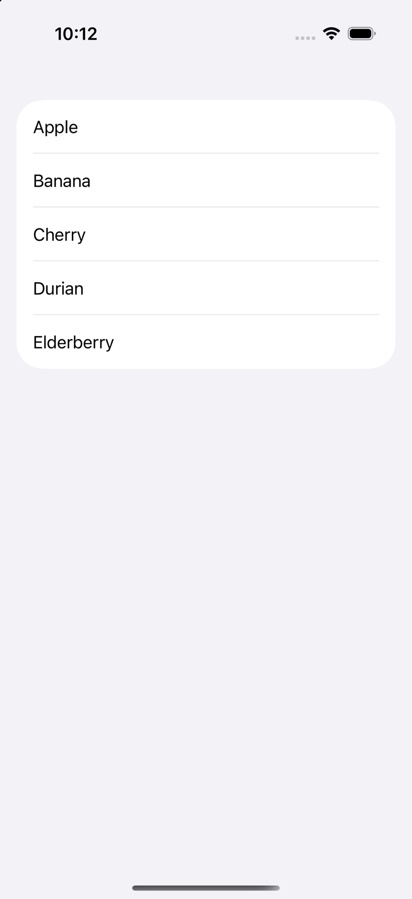 |

差異: iOS の既定は insetGrouped(角丸カード)、Web は plain(UITableView 風)。
`.listStyle` は未実装。

## ScrollView

```swift
ScrollView {
    VStack(spacing: 0) {
        ForEach(0..<25, id: \.self) { i in
            Text("Row \(i)").padding(12)
            Divider()
        }
    }
}
```

| Web (SwiftWasmUI) | iOS (SwiftUI) |
|---|---|
| 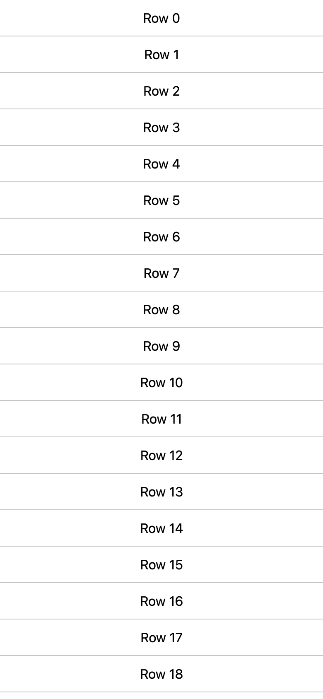 | 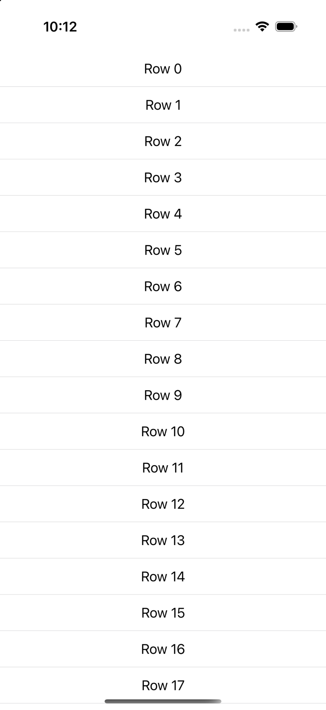 |

差異: Web は `Divider` が画面幅いっぱい(iOS はコンテンツ幅)。スクロールバー表示はブラウザ依存。

## Shapes

```swift
HStack(spacing: 20) {
    Rectangle().fill(.blue).frame(width: 64, height: 64)
    RoundedRectangle(cornerRadius: 16).fill(.green).frame(width: 64, height: 64)
    Circle().fill(.red).frame(width: 64, height: 64)
}
Capsule().fill(.gray).frame(width: 120, height: 44)
HStack(spacing: 20) {
    RoundedRectangle(cornerRadius: 12).fill(.blue).frame(width: 64, height: 64).opacity(0.35)
    RoundedRectangle(cornerRadius: 12).fill(.blue).frame(width: 64, height: 64).shadow(radius: 8, y: 4)
    RoundedRectangle(cornerRadius: 12).fill(.white).frame(width: 64, height: 64).border(.red, width: 2)
}
```

| Web (SwiftWasmUI) | iOS (SwiftUI) |
|---|---|
| 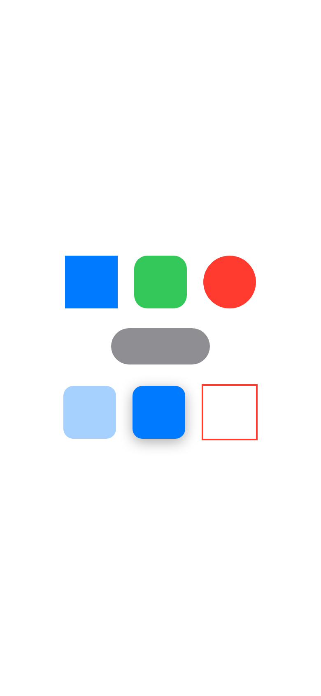 | 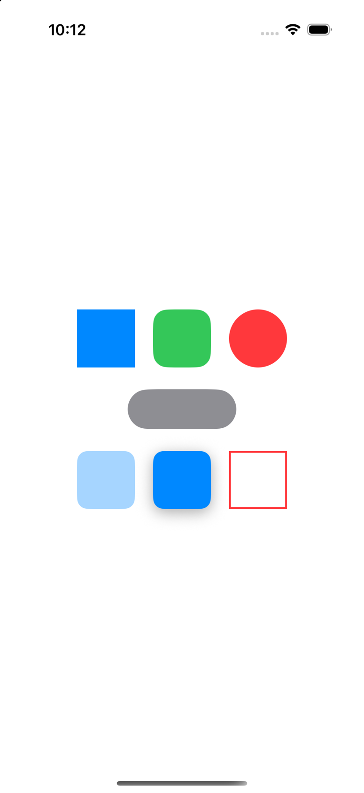 |

差異: なし。

## Progress

```swift
VStack(spacing: 16) {
    ProgressView()
    Text("Loading...").foregroundColor(.gray)
}
```

| Web (SwiftWasmUI) | iOS (SwiftUI) |
|---|---|
|  | 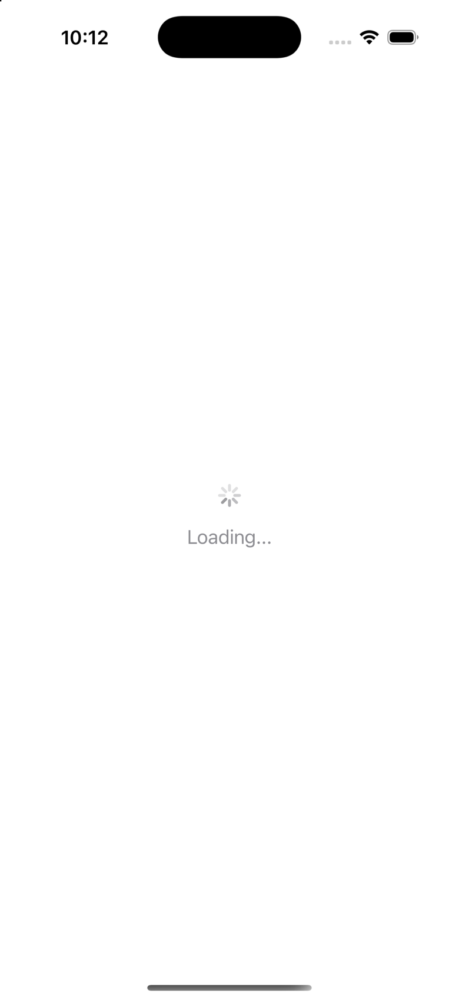 |

差異: Web は円弧スピナー(CSS アニメーション)、iOS は 8 枚羽根の UIActivityIndicator。

## Modifiers

```swift
VStack(spacing: 20) {
    Text("padding + background + cornerRadius")
        .foregroundColor(.white)
        .padding()
        .background(.blue)
        .cornerRadius(12)
    Text("border").padding(12).border(.red, width: 2)
    Text("shadow").padding(12).background(.white).cornerRadius(8).shadow(radius: 6, y: 2)
    Text("opacity 0.4").opacity(0.4)
}
```

| Web (SwiftWasmUI) | iOS (SwiftUI) |
|---|---|
| 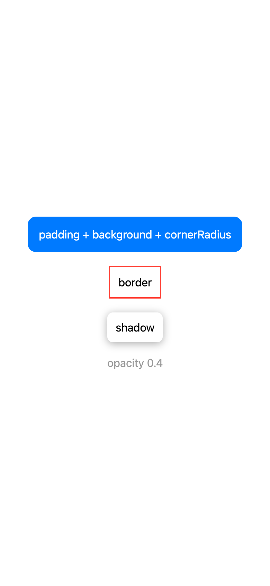 | 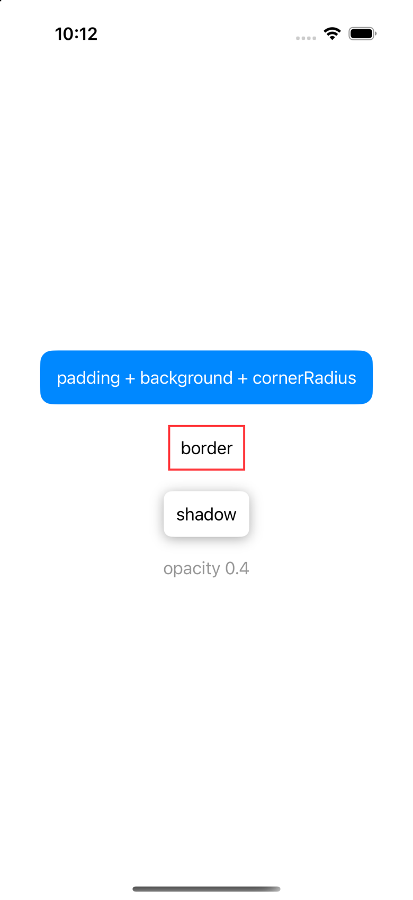 |

差異: モディファイアの適用順序の意味(内→外)も含めて一致。

## Glass

```swift
VStack(spacing: 16) {
    Text("Liquid Glass")
        .font(.headline)
        .padding(20)
        .glassEffect()
    HStack(spacing: 12) {
        Image(systemName: "heart.fill").foregroundColor(.red)
        Text("Glass card")
    }
    .padding(20)
    .glassEffect()
}
// 背景: Web は Color(css: "linear-gradient(...)")、iOS は LinearGradient
```

| Web (SwiftWasmUI) | iOS (SwiftUI) |
|---|---|
| 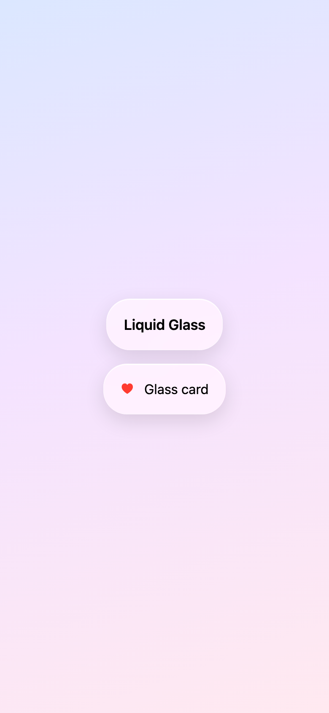 | 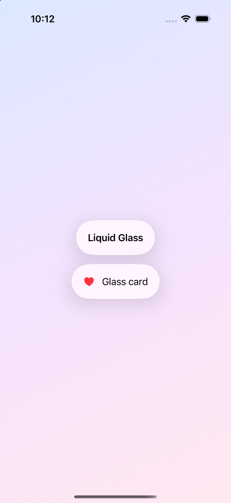 |

差異: iOS は本物の Liquid Glass(iOS 26 `.glassEffect()`)、Web は
`backdrop-filter: blur + saturate` による近似。屈折・スペキュラは再現していない。

---

## 再現手順

```bash
bash scripts/build-web.sh
python3 -m http.server 8642 --directory Web &   # Web サーバ
# iOSDemo をビルドしてシミュレータへインストール後:
SIM_UDID=<booted-udid> bash scripts/capture-comparison.sh
```

- 検証画面の実体: `Sources/SwiftWasmUIDemo/CatalogScreens.swift`(Web)/
  `iOSDemo/CatalogScreens.swift`(iOS)。**両ファイルの画面 body は一字一句同じに保つこと。**
- Web は URL ハッシュ(`#text` 等)、iOS は起動引数(`-screen text`)で画面を選択する。
